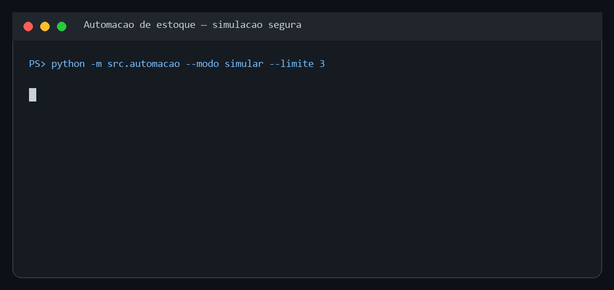

# Automação de cadastro de produtos

[](https://github.com/pedrollima2002/automacao-de-estoque/actions/workflows/tests.yml)

Automação educacional em Python para validar um catálogo em CSV e preencher um formulário web com PyAutoGUI. O projeto foi estruturado para ser demonstrável sem risco: o modo padrão apenas simula, registra logs e não abre o navegador nem controla mouse e teclado.

> Use o modo real somente em sistemas nos quais você tem autorização. Automação por coordenadas depende da resolução, do zoom, do layout da página e do foco correto da janela.

## O que o projeto demonstra

- validação do CSV antes de qualquer interação com a tela;
- rejeição de colunas ausentes, códigos duplicados e valores inválidos;
- credenciais locais em `.env`, fora do Git;
- configurações de URL, tempos e coordenadas em JSON;
- simulação segura para revisão dos dados;
- execução em lotes com `--limite`;
- retomada pelo último item concluído;
- logs por execução e captura de tela em caso de falha;
- interrupção de emergência do PyAutoGUI ao mover o mouse para um canto da tela;
- testes automatizados das regras críticas.

## Demonstração segura



```text
python -m src.automacao --modo simular --limite 3

Modo selecionado: simular
Validação concluída: 5 produto(s).
SIMULAÇÃO | linha=1 | codigo=DEMO001 | marca=Marca Demo | tipo=Mouse | preco=59.90
SIMULAÇÃO | linha=2 | codigo=DEMO002 | marca=Marca Demo | tipo=Teclado | preco=149.90
SIMULAÇÃO | linha=3 | codigo=DEMO003 | marca=Exemplo Tech | tipo=Monitor | preco=899.00
Simulação concluída: 3 produto(s). Nenhum dado foi enviado.
```

A simulação usa [`data/produtos_exemplo.csv`](data/produtos_exemplo.csv), com dados fictícios. Cada execução cria um arquivo em `logs/`; essa pasta é ignorada pelo Git.

## Requisitos

- Python 3.10 ou superior;
- Windows, macOS ou Linux com interface gráfica para o modo real;
- navegador padrão configurado;
- acesso autorizado ao formulário que será automatizado.

## Instalação no Windows

```powershell
git clone https://github.com/pedrollima2002/automacao-de-estoque.git
cd automacao-de-estoque
py -m venv .venv
.\.venv\Scripts\Activate.ps1
python -m pip install -r requirements.txt
```

Em macOS ou Linux, ative o ambiente com `source .venv/bin/activate`.

## Primeiro uso: apenas simular

```powershell
python -m src.automacao
```

O comando valida as cinco linhas fictícias e lista o que seria processado. Para testar outro arquivo sem realizar cadastro:

```powershell
python -m src.automacao --arquivo data/produtos.csv --modo simular --limite 10
```

O CSV precisa ter ao menos estas colunas de negócio:

```text
codigo,marca,tipo,categoria,preco_unitario,custo,obs
```

`codigo`, `marca`, `tipo` e `categoria` não podem ficar vazios. Preço e custo devem ser números maiores ou iguais a zero. Códigos repetidos interrompem a validação.

## Configuração do modo real

1. Copie `.env.example` para `.env` e preencha suas credenciais locais.
2. Copie `config.example.json` para `config.local.json`.
3. Ajuste URL, tempos e coordenadas em `config.local.json`.
4. Mantenha a página com zoom de 100% e a mesma resolução usada na captura.
5. Rode novamente em simulação com o arquivo que pretende usar.

Para descobrir uma coordenada, posicione o mouse sobre o campo e execute:

```powershell
python capturar_posicao.py --segundos 5
```

O script imprime `[x, y]`. Capture a posição do campo de e-mail e a posição do primeiro campo do formulário de produto.

## Execução real

Feche aplicativos que possam roubar o foco e comece com um único registro:

```powershell
python -m src.automacao `
  --arquivo data/produtos_exemplo.csv `
  --config config.local.json `
  --modo executar `
  --confirmar-envio `
  --limite 1
```

Sem `--confirmar-envio`, o modo real é bloqueado. Durante a execução, não use mouse nem teclado. Para abortar, mova rapidamente o cursor para um dos cantos da tela; o mecanismo de segurança do PyAutoGUI interrompe o processo.

Depois de cada item concluído, o índice é salvo em `estado/progresso.json`. Repetir o comando continua do próximo item. Se o CSV mudar, a retomada é bloqueada para evitar usar um índice antigo.

Para recomeçar conscientemente:

```powershell
python -m src.automacao --modo executar --confirmar-envio --reiniciar-progresso
```

Também é possível começar em uma linha específica com `--iniciar-em 5`. Isso ignora o índice salvo; use somente depois de conferir se não criará duplicatas.

## Testes

```powershell
python -m unittest discover -s tests -v
```

Os testes cobrem leitura dos dados, preservação de códigos com zeros, formatação de valores, colunas obrigatórias, duplicidade, preço negativo, configuração e retomada segura.

## Estrutura

```text
automacao-de-estoque/
├── data/
│   ├── produtos_exemplo.csv
│   └── produtos.csv
├── src/
│   └── automacao.py
├── tests/
│   └── test_automacao.py
├── .env.example
├── capturar_posicao.py
├── config.example.json
├── requirements.txt
└── README.md
```

## Limitações reais

Este projeto não é uma integração robusta com o sistema. PyAutoGUI reproduz cliques e teclas; ele não entende o HTML nem confirma de forma confiável que o servidor aceitou cada cadastro. Mudanças visuais, lentidão, pop-ups ou perda de foco podem deslocar todo o fluxo.

Em produção, a solução correta é usar uma API oficial do sistema ou automação de navegador com seletores e validação explícita da resposta. Aqui, PyAutoGUI foi mantido porque é o objeto técnico do projeto e permite demonstrar validação, segurança operacional, logs e retomada.

## Segurança e privacidade

- nunca publique `.env`;
- use apenas dados fictícios no portfólio;
- revise o primeiro cadastro manualmente antes de ampliar o lote;
- confira logs e o sistema de destino depois de cada lote;
- não use esta automação para contornar permissões ou termos de uso.
